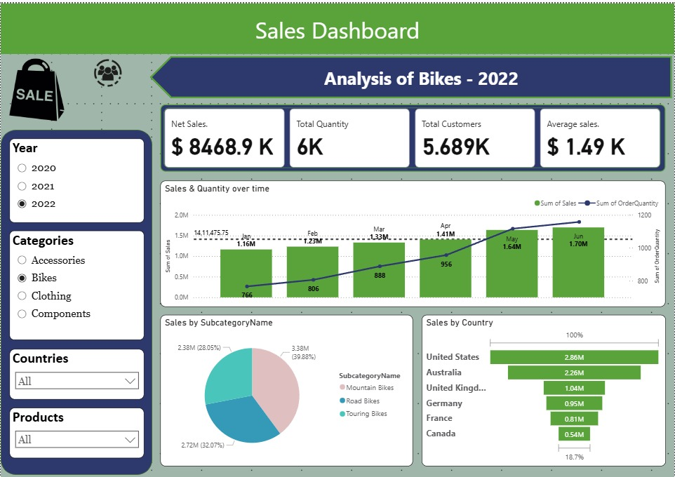

# 📊 Power BI Dashboard Project

Welcome to the **Power BI Dashboard Project**! This repository contains a data visualization dashboard built using **Microsoft Power BI** to turn complex datasets into meaningful, interactive insights.

---

## 📁 Folder Structure

The project is organized as follows:
```
├── 📂 data # Raw and processed datasets (CSVs)
├── 📂 logo # Branding assets and logos
├── 📂 screenshots # Images and snapshots of the dashboard
├── 📊 dashboard # Power BI (.pbix) file and related assets
├── 📜 readme.md # This documentation file

```

---

## 🧠 Project Overview

This dashboard is designed to:
- Visualize key business KPIs
- Support data-driven decision making
- Provide drill-down capabilities for in-depth analysis
- Be intuitive and user-friendly across web and mobile platforms

---

## 🖼️ Dashboard Preview




---

## 🔍 Features

- 📌 Real-time visualizations (connected to live or refreshed data)
- 🧩 Custom DAX formulas for calculated metrics
- 🔍 Interactive filtering and drill-down options
- 📱 Mobile-friendly and web-optimized layout
- 🎨 Branded design with custom themes and logos

---

## 🧰 Tools & Technologies

- Microsoft Power BI
- Power Query (M language)
- DAX (Data Analysis Expressions)
- Excel / SQL (data sources)
- Git & GitHub (version control)

---

## 📂 How to Use

1. Clone this repository:
    ```bash
    git clone https://github.com/your-username/powerbi-dashboard.git
    ```

2. Open the `.pbix` file in Power BI Desktop:
    ```bash
    /dashboard/your-dashboard.pbix
    ```

3. Load the datasets from the `/data` folder or connect to your own data source.

---


## Contributing

Contributions are welcome! Please open issues or submit pull requests to help improve this repository.

## License

This project is licensed under the MIT License.

## Contact Me

Feel free to reach out if you have any questions, suggestions, or just want to connect!

- **Email:** [sunilsharma.work@outlook.com](mailto:sunilsharma.work@outlook.com)
- **Phone:** +91 9352628954
- **LinkedIn:** [linkedin.com/in/sunil sharma](https://www.linkedin.com/in/sunil-sharma-31003143a/)

I look forward to hearing from you!
